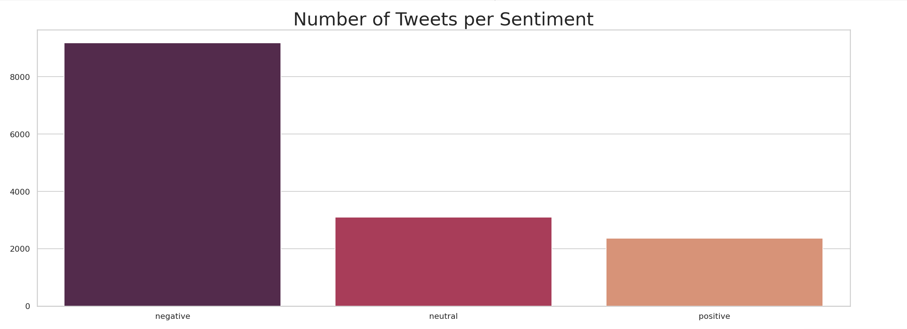
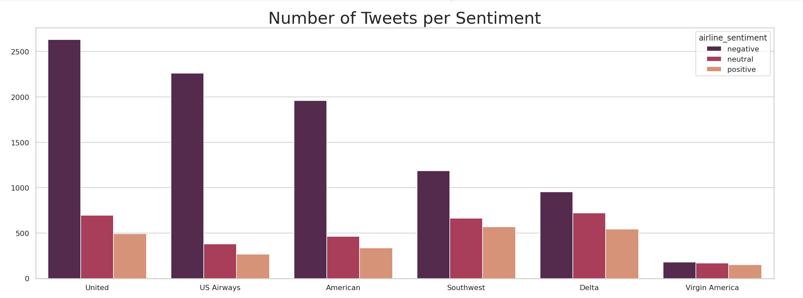

# Twitter-Sentiment-Analysis-on-Airlines


## Table of Contents

* [Business Understanding](#business-understanding)
* [Data Understanding](#data-understanding)
* [Modeling](#modeling)
* [Best Performing Model](#best-performing-model)
* [Recommendation](#recommendation)
* [Next Step](#next-step)

## Business Understanding

Airline companies wants to use model to identify customers that are having a negative experience and direct tweets with negative sentiment towards the proper channel.

One way this might be accomplished would be to set up a bot that uses sentiment analysis to automatically identify tweets with negative sentiment, and then direct those tweets to the appropriate customer service representative or department for further assistance.

By implementing this system, the airline company can improve customer satisfaction by addressing negative experiences more quickly and efficiently, increase brand loyalty by showing that they value and take action on customer feedback.

## Data Understanding

The dataset used in this project is provided from [Kaggle](https://www.kaggle.com/datasets/crowdflower/twitter-airline-sentiment) and originally collected by Crowdflower’s Data for Everyone library.

This Twitter data was scraped on **February 2015**. It contains tweets on six major United States (US) airlines: 
United, Us Airways, American, Soutwest, Delta and Virgin America.

Dataset has **14,640 entries** and **15 columns**.

We have three different target categories as **positive, neutral** or **negative** depend on tweet.

### Data Preparation and Exploration

- Duplicated rows were dropped and rows that had missing values were dropped

- Links, punctuation and stopwords were removed from the data prior to modeling. '#' was removed from twitter hashtags.
The data was small enough that lemmatization was usable to reduce the dimensionality of the data.

- To get a general idea of both the word frequencies and twitter sentiments several data visualizations were made:


- The meaningful words that can be spotted in the positive sentiments’ word cloud directly include **“thank”, “flight”** and **“great”**. This shows people tend to appreciate the airline on social media when they have positive flight experience.


- We observe from the word cloud that tweets related to **"flight"** and **"hour"** are causing the most negative tweets. And also **"cancelled","delayed", "customer"** and **"service"** have higher frequencies than other words.



- we can clearly see that these tweets are overwhelmingly **negative**.


- Most of the tweets belongs to **United Airlines** and followed by **US Airways , American**.



- Looking at the number of negative sentiments, **United Airline** ranks the first, followed by **US Airways Airline** and **American Airline**.

## Modeling

- The sentiment column served as the target, and tweet column as the predictor variable in our modeling. 
- Class imbalance was an issue found during modeling. 
- Logistic Regression, Naive Bayes, Support Vector Classifier were tested as well as LSTM network
- Although most of models had overfitting issues, Multinomial Naive Bayes showed slight improvement on overfitting with the highest F1 score of 91%


## Best Performing Model

- Throughout the project, our goal was reducing False Negatives and False Positives

  -**False Positive:** Model predicts negative tweet but it's actually positive, leading to wrong customer service response and wasting company time/money.
  
  -**False Negative:** Model predicts positive tweet but it's actually negative, leading to lack of proper customer service and potential loss of customer.

- To balance the downsides of False Positive and False Negative, F1-score is used to find maximum negative sentiment tweets while avoiding incorrect customer service actions.


-  Best accuracy and F1 score were achieved through parameter tuning with GridSearch on **Support Vector Classifier.**


## Recommendation

- One thing I noticed is that a tweet can have positive language, but the user can be using sarcasm which can throw the model off. With more time, we should look deeper into this.

- The bot might offer personalized solutions based on the negative sentiment reason. For example, if a customer is dissatisfied with flight delays,we might offer alternatives such as offering a discount or refund.

## Next Step

- Further investigation into the causes of misclassification could be the next step to enhance the model.
- The data was limited to tweets from February 2015, it is probable that collecting data for the entire year would result in a more robust and generalizable model.
- According to the analysis the data set contains way more negative tweets than positive ones. Future works may focus on obtaining a more balanced and larger dataset for better classifier model performance.


```
├── images
├── Exploratory_Data_Analysis.ipynb
├── Preprocessing_and_Modeling.ipynb
├── README.md
├── Tweets.csv
└── pdfs
```


